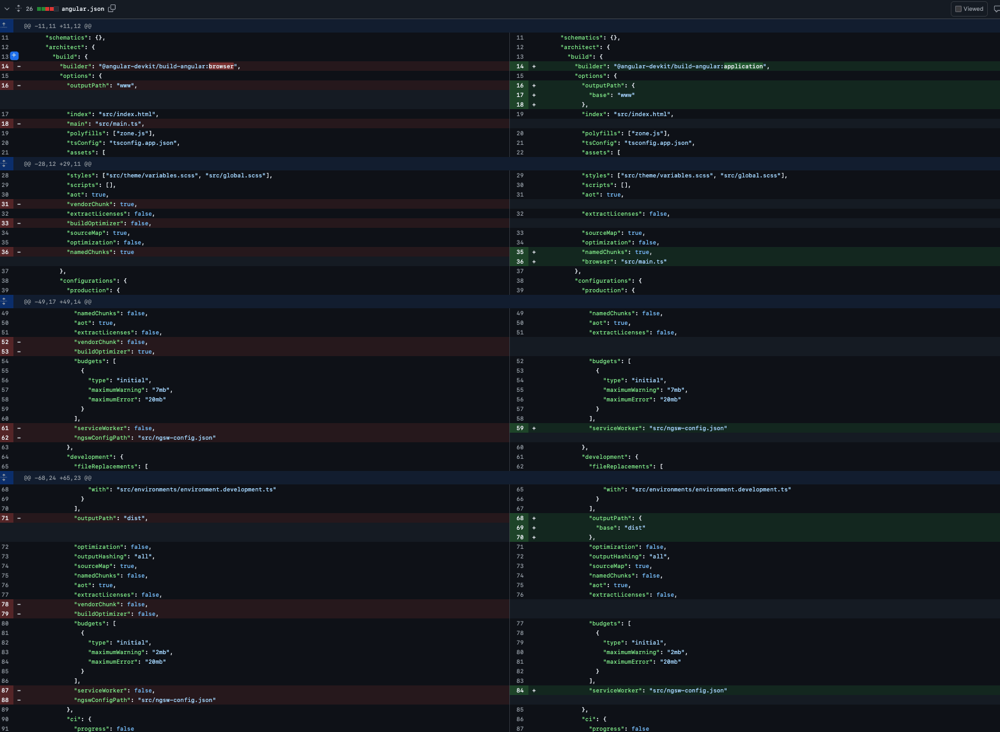
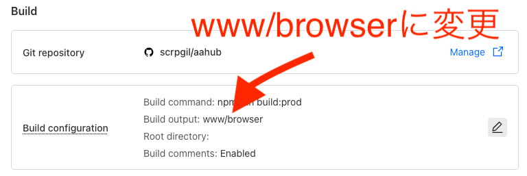

# 個人制作サイトを Angular 17→19 にアップデートした記録

更新が遅れてしまい、申し訳ありません！
こちらは [Angular Advent Calendar 2024](https://qiita.com/advent-calendar/2024/angular) の 14 日目の記事となります。
13 日目の記事は [rysiva](https://qiita.com/rysiva) さんが投稿されましたので、あわせてご覧ください。

日々の業務でも Angular を活用しているため、この 1 年間の振り返りとして共有できるトピックを考えていました。その中で、個人制作のサイトがずっと Angular 17 のまま止まっていることが気になり、今回アップデートを行うことにしました。本記事では、その更新内容とプロセスをご紹介します。

## アップデートしたサイト

今回アップデートしたのは、個人で制作している [アスキーアート閲覧サイト](https://aahub.org/) です。
このサイトは Ionic と Angular を用いて構築しています。昨年のアドベントカレンダーでも各モジュールのバージョンアップなどを行いましたが、その後しばらく手をつけていなかったため、今回の題材にはうってつけと考えました。
今年は、このサイトを最新バージョンへとアップデートする手順やポイントをまとめてみたいと思います。

## アップデート後の変化

ビルドシステムの変更により、ビルド速度が改善しました（約 1 分 30 秒 → 約 55 秒）。
PageSpeed Insights でパフォーマンスを計測してみましたが、特に改善は見られませんでした。

できれば SSR（Server-Side Rendering）にも挑戦してみたかったのですが、途中でハマってしまい、今回の記事には間に合いませんでした。もし今後 SSR を導入でき、変化があれば追記する予定です。

## アップデート前後の package.json

今回のアップデートでは、`wrangler` などの古い依存パッケージもまとめて更新を行いました。
以下は、アップデート前後の `package.json` です。

<details><summary>変更前</summary>

```json
{
  "dependencies": {
    "@angular/animations": "^17.3.7",
    "@angular/common": "^17.3.7",
    "@angular/core": "^17.3.7",
    "@angular/forms": "^17.3.7",
    "@angular/platform-browser": "^17.3.7",
    "@angular/platform-browser-dynamic": "^17.3.7",
    "@angular/router": "^17.3.7",
    "@cloudflare/d1": "^1.4.1",
    "@ionic/angular": "^8.0.0-rc.2",
    "@prisma/adapter-d1": "^5.13.0",
    "@prisma/client": "^5.13.0",
    "dom-to-image-more-sjis-art": "^2.8.4",
    "encoding-japanese": "^1.0.30",
    "file-saver": "^2.0.2",
    "firebase": "^10.7.0",
    "hono": "^4.2.8",
    "ionicons": "^7.2.1",
    "rxjs": "^7.8.0",
    "ts-md5": "^1.3.1",
    "tslib": "^2.3.0",
    "zone.js": "~0.14.2"
  },
  "devDependencies": {
    "@angular-devkit/build-angular": "^17.3.6",
    "@angular-eslint/builder": "17.3.0",
    "@angular-eslint/eslint-plugin": "17.3.0",
    "@angular-eslint/eslint-plugin-template": "17.3.0",
    "@angular-eslint/schematics": "17.3.0",
    "@angular-eslint/template-parser": "17.3.0",
    "@angular/cli": "^17.3.6",
    "@angular/compiler-cli": "^17.3.7",
    "@angular/language-service": "^17.3.7",
    "@chromatic-com/storybook": "^1.2.25",
    "@cloudflare/kv-asset-handler": "^0.3.0",
    "@cloudflare/workers-types": "^4.20231121.0",
    "@compodoc/compodoc": "^1.1.23",
    "@ionic/angular-toolkit": "^9.0.0",
    "@miniflare/tre": "^3.0.0-next.13",
    "@rdlabo/eslint-plugin-rules": "^0.1.1",
    "@storybook/addon-docs": "^8.0.4",
    "@storybook/addon-essentials": "^8.0.4",
    "@storybook/addon-interactions": "^8.0.4",
    "@storybook/addon-links": "^8.0.4",
    "@storybook/angular": "^8.0.4",
    "@storybook/blocks": "^8.0.4",
    "@storybook/test": "^8.0.4",
    "@testing-library/angular": "^16.0.0",
    "@testing-library/user-event": "^14.5.2",
    "@types/jasmine": "~5.1.0",
    "@types/prettier": "^2.7.2",
    "@typescript-eslint/eslint-plugin": "^7.2.0",
    "@typescript-eslint/parser": "^7.2.0",
    "eslint": "^8.57.0",
    "eslint-config-prettier": "^9.1.0",
    "eslint-formatter-summary": "^1.1.0",
    "eslint-plugin-import": "2.29.1",
    "eslint-plugin-jsdoc": "48.0.4",
    "eslint-plugin-prefer-arrow": "1.2.2",
    "eslint-plugin-prettier": "^5.1.3",
    "eslint-plugin-storybook": "^0.6.12",
    "eslint-todo-generator": "^0.1.0",
    "jasmine-core": "~5.1.0",
    "jasmine-spec-reporter": "~5.0.0",
    "karma": "~6.4.0",
    "karma-chrome-launcher": "~3.2.0",
    "karma-coverage": "~2.2.0",
    "karma-coverage-istanbul-reporter": "~3.0.2",
    "karma-jasmine": "~5.1.0",
    "karma-jasmine-html-reporter": "^2.1.0",
    "prettier": "^3.2.4",
    "prettier-eslint": "^15.0.1",
    "prisma": "^5.13.0",
    "protractor": "~7.0.0",
    "source-map-explorer": "^2.5.3",
    "storybook": "^8.0.4",
    "stylelint": "^16.2.0",
    "stylelint-config-standard": "^36.0.0",
    "stylelint-config-standard-scss": "^13.0.0",
    "stylelint-prettier": "^5.0.0",
    "stylelint-scss": "^6.1.0",
    "tailwindcss": "^3.3.2",
    "ts-node": "~8.3.0",
    "typescript": "~5.2.2",
    "wrangler": "^0.0.0-04a2d0ed"
  },
  "description": "An Ionic project"
}
```

</details>

<details><summary>変更後</summary>

```json
{
  "dependencies": {
    "@angular/animations": "^19.0.4",
    "@angular/common": "^19.0.4",
    "@angular/core": "^19.0.4",
    "@angular/forms": "^19.0.4",
    "@angular/platform-browser": "^19.0.4",
    "@angular/platform-browser-dynamic": "^19.0.4",
    "@angular/router": "^19.0.4",
    "@angular/service-worker": "^19.0.4",
    "@cloudflare/d1": "^1.4.1",
    "@ionic/angular": "^8.0.0-rc.2",
    "@prisma/adapter-d1": "^5.13.0",
    "@prisma/client": "^5.13.0",
    "dom-to-image-more-sjis-art": "^2.8.4",
    "encoding-japanese": "^1.0.30",
    "file-saver": "^2.0.2",
    "firebase": "^10.7.0",
    "hono": "^4.2.8",
    "ionicons": "^7.2.1",
    "rxjs": "^7.8.0",
    "ts-md5": "^1.3.1",
    "tslib": "^2.3.0",
    "zone.js": "~0.15.0"
  },
  "devDependencies": {
    "@angular-devkit/build-angular": "^19.0.5",
    "@angular-eslint/builder": "19.0.2",
    "@angular-eslint/eslint-plugin": "19.0.2",
    "@angular-eslint/eslint-plugin-template": "19.0.2",
    "@angular-eslint/schematics": "19.0.2",
    "@angular-eslint/template-parser": "19.0.2",
    "@angular/cli": "^19.0.5",
    "@angular/compiler-cli": "^19.0.4",
    "@angular/language-service": "^19.0.4",
    "@chromatic-com/storybook": "^1.2.25",
    "@cloudflare/kv-asset-handler": "^0.3.0",
    "@cloudflare/workers-types": "^4.20231121.0",
    "@compodoc/compodoc": "^1.1.23",
    "@ionic/angular-toolkit": "^9.0.0",
    "@miniflare/tre": "^3.0.0-next.13",
    "@rdlabo/eslint-plugin-rules": "^0.1.1",
    "@storybook/addon-docs": "^8.4.7",
    "@storybook/addon-essentials": "^8.4.7",
    "@storybook/addon-interactions": "^8.4.7",
    "@storybook/addon-links": "^8.4.7",
    "@storybook/angular": "^8.4.7",
    "@storybook/blocks": "^8.4.7",
    "@storybook/test": "^8.4.7",
    "@testing-library/angular": "^17.3.4",
    "@testing-library/dom": "^10.0.0",
    "@testing-library/user-event": "^14.5.2",
    "@types/jasmine": "~5.1.0",
    "@types/prettier": "^2.7.2",
    "@typescript-eslint/eslint-plugin": "^7.2.0",
    "@typescript-eslint/parser": "^7.2.0",
    "eslint": "^8.57.0",
    "eslint-config-prettier": "^9.1.0",
    "eslint-formatter-summary": "^1.1.0",
    "eslint-plugin-import": "2.29.1",
    "eslint-plugin-jsdoc": "48.0.4",
    "eslint-plugin-prefer-arrow": "1.2.2",
    "eslint-plugin-prettier": "^5.1.3",
    "eslint-plugin-storybook": "^0.6.12",
    "eslint-todo-generator": "^0.1.0",
    "jasmine-core": "~5.1.0",
    "jasmine-spec-reporter": "~5.0.0",
    "karma": "~6.4.0",
    "karma-chrome-launcher": "~3.2.0",
    "karma-coverage": "~2.2.0",
    "karma-coverage-istanbul-reporter": "~3.0.2",
    "karma-jasmine": "~5.1.0",
    "karma-jasmine-html-reporter": "^2.1.0",
    "prettier": "^3.2.4",
    "prettier-eslint": "^15.0.1",
    "prisma": "^5.13.0",
    "source-map-explorer": "^2.5.3",
    "storybook": "^8.4.7",
    "stylelint": "^16.2.0",
    "stylelint-config-standard": "^36.0.0",
    "stylelint-config-standard-scss": "^13.0.0",
    "stylelint-prettier": "^5.0.0",
    "stylelint-scss": "^6.1.0",
    "tailwindcss": "^3.3.2",
    "ts-node": "~8.3.0",
    "typescript": "~5.5.4",
    "wrangler": "^3.95.0"
  },
  "description": "An Ionic project"
}
```

</details>

## アップデートでやったこと

今回のアップデートで行った主な作業は以下のとおりです。

- Angular 17 → 18 へのアップデート
- Angular 18 → 19 へのアップデート
- 不要な import 文の削除
- signal 化対応
- Cloudflare Pages へのアップロード

## 17→18 へのアップデート

おなじみの ng update コマンドを実行し、言われた通りに update していきます。
まずは、17 から 18 にアップデートしていきます。

<details><summary>ng update</summary>

```shell
% ng update
Using package manager: npm
Collecting installed dependencies...
Found 82 dependencies.
    We analyzed your package.json, there are some packages to update:

      Name                                    Version                  Command to update
     -------------------------------------------------------------------------------------
      @angular-eslint/schematics              17.3.0 -> 19.0.2         ng update @angular-eslint/schematics
      @angular/cli                            17.3.6 -> 18.2.9         ng update @angular/cli@18
      @angular/core                           17.3.7 -> 18.2.9         ng update @angular/core@18
      @testing-library/angular                16.0.0 -> 17.3.4         ng update @testing-library/angular

    There might be additional packages which don't provide 'ng update' capabilities that are outdated.
    You can update the additional packages by running the update command of your package manager.

```

</details>

基本的に ng update で提示されたコマンドを入力してもなんらかの依存関係のエラーはでるかと思います。
今回は@storybook/angular でエラーがでたので、個別に最新にアップデートしました

```shell
npm i storybook@8.4.7 --save-dev
```

エラーを解決し、ng udpate が実行できるようになったので再度実行します。
`ng update @angular/cli@18 @angular/core@18`実行の途中で migration 周りを確認されるので取り合えずイエス。

## 17→18 へのアップデート

ここからは、`ng update` コマンドを用いて Angular のバージョンを 17 から 18 へ引き上げていきます。

まず、`ng update` を実行すると、以下のようなメッセージが表示されます。

<details><summary>ng update</summary>

```shell
% ng update
Using package manager: npm
Collecting installed dependencies...
Found 82 dependencies.
    We analyzed your package.json, there are some packages to update:

      Name                                    Version                  Command to update
     -------------------------------------------------------------------------------------
      @angular-eslint/schematics              17.3.0 -> 19.0.2         ng update @angular-eslint/schematics
      @angular/cli                            17.3.6 -> 18.2.9         ng update @angular/cli@18
      @angular/core                           17.3.7 -> 18.2.9         ng update @angular/core@18
      @testing-library/angular                16.0.0 -> 17.3.4         ng update @testing-library/angular

    There might be additional packages which don't provide 'ng update' capabilities that are outdated.
    You can update the additional packages by running the update command of your package manager.
```

</details>

ここで、ng update から提案されたコマンドを順番に実行していきますが、しばしば依存関係エラーが発生します。
今回は @storybook/angular に起因するエラーがあったため、該当パッケージを手動で最新バージョンに更新しました。

```shell
npm i storybook@8.4.7 --save-dev
```

このエラー解消後、ng update コマンドが正常に実行できるようになったので、改めて以下を実行します。

```shell
ng update @angular/cli@18 @angular/core@18
```

実行中にマイグレーションに関する確認が求められますが、今回の場合は特に migration による変更はないようでした。

<details><summary>ng update @angular/cli@18 @angular/core@18</summary>

```shell
% ng update @angular/cli@18 @angular/core@18
The installed Angular CLI version is outdated.
Installing a temporary Angular CLI versioned 18.2.12 to perform the update.
✔ Packages successfully installed.
Using package manager: npm
Collecting installed dependencies...
Found 82 dependencies.
Fetching dependency metadata from registry...
                  Package "@angular/compiler-cli" has a missing peer dependency of "@angular/compiler" @ "18.2.13".
                  Package "@angular/platform-browser-dynamic" has a missing peer dependency of "@angular/compiler" @ "18.2.13".
    Updating package.json with dependency @angular-devkit/build-angular @ "18.2.12" (was "17.3.6")...
    Updating package.json with dependency @angular/cli @ "18.2.12" (was "17.3.6")...
    Updating package.json with dependency @angular/compiler-cli @ "18.2.13" (was "17.3.7")...
    Updating package.json with dependency @angular/language-service @ "18.2.13" (was "17.3.7")...
    Updating package.json with dependency typescript @ "5.5.4" (was "5.2.2")...
    Updating package.json with dependency @angular/animations @ "18.2.13" (was "17.3.7")...
    Updating package.json with dependency @angular/common @ "18.2.13" (was "17.3.7")...
    Updating package.json with dependency @angular/core @ "18.2.13" (was "17.3.7")...
    Updating package.json with dependency @angular/forms @ "18.2.13" (was "17.3.7")...
    Updating package.json with dependency @angular/platform-browser @ "18.2.13" (was "17.3.7")...
    Updating package.json with dependency @angular/platform-browser-dynamic @ "18.2.13" (was "17.3.7")...
    Updating package.json with dependency @angular/router @ "18.2.13" (was "17.3.7")...
    Updating package.json with dependency zone.js @ "0.14.10" (was "0.14.4")...
UPDATE package.json (3826 bytes)
✔ Cleaning node modules directory
✔ Installing packages
** Optional migrations of package '@angular/cli' **

This package has 1 optional migration that can be executed.
Optional migrations may be skipped and executed after the update process, if preferred.

 Select the migrations that you'd like to run

** Executing migrations of package '@angular/core' **

❯ Updates two-way bindings that have an invalid expression to use the longform expression instead.
  Migration completed (No changes made).

❯ Replace deprecated HTTP related modules with provider functions.
UPDATE src/app/services/worker-api.ts (4427 bytes)
  Migration completed (1 file modified).

❯ Updates calls to afterRender with an explicit phase to the new API.
  Migration completed (No changes made).

```

</details>

## 18→19 へのアップデート

Angular 18 へのアップデートが完了したら、同様に `ng update` コマンドで 19 へのアップデートを進めます。

<details><summary>ng update</summary>

```shell
% ng update
Using package manager: npm
Collecting installed dependencies...
Found 82 dependencies.
    We analyzed your package.json, there are some packages to update:

      Name                                    Version                  Command to update
     -------------------------------------------------------------------------------------
      @angular-eslint/schematics              18.4.3 -> 19.0.2         ng update @angular-eslint/schematics
      @angular/cli                            18.2.12 -> 19.0.5        ng update @angular/cli
      @angular/core                           18.2.13 -> 19.0.4        ng update @angular/core
      @testing-library/angular                16.0.0 -> 17.3.4         ng update @testing-library/angular

    There might be additional packages which don't provide 'ng update' capabilities that are outdated.
    You can update the additional packages by running the update command of your package manager.
```

</details>

ここでも、ng update が提案するコマンドを実行していきます。
途中でビルドシステムの変更や standalone をデフォルトとするかどうかといったオプションについて尋ねられますが、今回は「Yes」を選択しました。その結果、自動的に standalone: true が削除され、standalone がデフォルト設定として適用されました。

<details><summary>ng update @angular/cli @angular/core</summary>

```shell
% ng update @angular/cli @angular/core
The installed Angular CLI version is outdated.
Installing a temporary Angular CLI versioned 19.0.5 to perform the update.
Using package manager: npm
Collecting installed dependencies...
Found 83 dependencies.
Fetching dependency metadata from registry...
                  Package "@angular/compiler-cli" has a missing peer dependency of "@angular/compiler" @ "19.0.4".
                  Package "@angular/platform-browser-dynamic" has a missing peer dependency of "@angular/compiler" @ "19.0.4".
    Updating package.json with dependency @angular-devkit/build-angular @ "19.0.5" (was "18.2.12")...
    Updating package.json with dependency @angular/cli @ "19.0.5" (was "18.2.12")...
    Updating package.json with dependency @angular/compiler-cli @ "19.0.4" (was "18.2.13")...
    Updating package.json with dependency @angular/language-service @ "19.0.4" (was "18.2.13")...
    Updating package.json with dependency @angular/animations @ "19.0.4" (was "18.2.13")...
    Updating package.json with dependency @angular/common @ "19.0.4" (was "18.2.13")...
    Updating package.json with dependency @angular/core @ "19.0.4" (was "18.2.13")...
    Updating package.json with dependency @angular/forms @ "19.0.4" (was "18.2.13")...
    Updating package.json with dependency @angular/platform-browser @ "19.0.4" (was "18.2.13")...
    Updating package.json with dependency @angular/platform-browser-dynamic @ "19.0.4" (was "18.2.13")...
    Updating package.json with dependency @angular/router @ "19.0.4" (was "18.2.13")...
    Updating package.json with dependency zone.js @ "0.15.0" (was "0.14.10")...
UPDATE package.json (3853 bytes)
✔ Cleaning node modules directory
✔ Installing packages
** Executing migrations of package '@angular/cli' **

❯ Update '@angular/ssr' import paths to use the new '/node' entry point when 'CommonEngine' is detected.
  Migration completed (No changes made).

❯ Update the workspace configuration by replacing deprecated options in 'angular.json' for compatibility with the latest Angular CLI changes.
  Migration completed (No changes made).

** Optional migrations of package '@angular/cli' **

This package has 1 optional migration that can be executed.
Optional migrations may be skipped and executed after the update process, if preferred.

 Select the migrations that you'd like to run [use-application-builder] Migrate application projects to the new build system.
(https://angular.dev/tools/cli/build-system-migration)

❯ Migrate application projects to the new build system.
  Application projects that are using the '@angular-devkit/build-angular' package's 'browser' and/or 'browser-esbuild' builders will be migrated to use the new 'application' builder.
  You can read more about this, including known issues and limitations, here: https://angular.dev/tools/cli/build-system-migration
    The output location of the browser build has been updated from "www" to "www/browser". You might need to adjust your deployment pipeline or, as an alternative, set outputPath.browser to "" in order to maintain the previous functionality.
    The output location of the browser build has been updated from "dist" to "dist/browser". You might need to adjust your deployment pipeline or, as an alternative, set outputPath.browser to "" in order to maintain the previous functionality.
UPDATE angular.json (6042 bytes)
UPDATE tsconfig.json (996 bytes)
  Migration completed (2 files modified).

** Executing migrations of package '@angular/core' **

❯ Updates non-standalone Directives, Component and Pipes to 'standalone:false' and removes 'standalone:true' from those who are standalone.
UPDATE src/app/pages/list/changelog/changelog.page.ts (1910 bytes)
UPDATE src/app/pages/login-modal/login-modal.page.ts (1630 bytes)
UPDATE src/app/components/search-result-list/search-result-list.component.ts (3280 bytes)
UPDATE src/app/pages/list/list.page.ts (9412 bytes)
UPDATE src/app/components/aahub-footer/aahub-footer.component.ts (828 bytes)
UPDATE src/app/components/aahub-logo/aahub-logo.component.ts (294 bytes)
UPDATE src/app/app.component.ts (2765 bytes)
UPDATE src/app/pages/editor/upload-mlt/upload-mlt.page.ts (5832 bytes)
UPDATE src/app/pages/view-popover/view-popover.page.ts (3533 bytes)
UPDATE src/app/pages/home/components/dashboard/dashboard.component.ts (2479 bytes)
UPDATE src/app/pages/home/components/aahub-navbar/aahub-navbar.component.ts (2858 bytes)
UPDATE src/app/pages/lightbox/lightbox.page.ts (5620 bytes)
UPDATE src/app/components/aa-text-control-panel/aa-text-control-panel.component.ts (1051 bytes)
UPDATE src/app/components/mlt-tag-header/mlt-tag-header.component.ts (712 bytes)
UPDATE src/app/components/aa-text/aa-text.component.ts (384 bytes)
UPDATE src/app/components/mlt-viewer/mlt-viewer.component.ts (7818 bytes)
UPDATE src/app/pages/home/components/mlt-list/components/mlt-list-item/mlt-list-item.component.ts (1653 bytes)
UPDATE src/app/pages/home/components/mlt-list/mlt-list.component.ts (960 bytes)
UPDATE src/app/pages/home/components/top/top.component.ts (4382 bytes)
UPDATE src/app/components/toggle-dark-mode-button/toggle-dark-mode-button.component.ts (943 bytes)
UPDATE src/app/pages/home/home.page.ts (13741 bytes)
UPDATE src/app/pages/search/search.page.ts (4950 bytes)
UPDATE src/app/pages/editor/editor.page.ts (8759 bytes)
UPDATE src/app/pages/mypage/mypage.page.ts (3530 bytes)
  Migration completed (24 files modified).

❯ Updates ExperimentalPendingTasks to PendingTasks.
  Migration completed (No changes made).

** Optional migrations of package '@angular/core' **

This package has 1 optional migration that can be executed.
Optional migrations may be skipped and executed after the update process, if preferred.

 Select the migrations that you'd like to run
```

</details>

また、`angular.json` もビルドシステムの変更に合わせて自動で書き換えられました。
このあたりは自分がまだキャッチアップできていない部分だったので、migration のサポートは本当に助かります。



## 不要な import 文削除

各モジュールのアップデートが完了したら、`ionic serve` または `ng serve` でアプリを起動してみます。
新しい Angular Compiler では、テンプレートで使用していない不要な import を警告してくれるため、それらをひとつずつ削除していきました。

不要な import が多くて、やや申し訳なさを感じつつの作業でしたが、そのおかげでコードはかなりスッキリしました。

<details><summary>[WARING] TS-998113: ...</summary>

```shell
[ng] ▲ [WARNING] TS-998113: IonSplitPane is not used within the template of AppComponent [plugin angular-compiler]
[ng]     src/app/app.component.ts:37:8:
[ng]       37 │         IonSplitPane,
[ng]          ╵         ~~~~~~~~~~~~
[ng] ▲ [WARNING] TS-998113: IonMenu is not used within the template of AppComponent [plugin angular-compiler]
[ng]     src/app/app.component.ts:38:8:
[ng]       38 │         IonMenu,
[ng]          ╵         ~~~~~~~
[ng] ▲ [WARNING] TS-998113: IonNav is not used within the template of AppComponent [plugin angular-compiler]
[ng]     src/app/app.component.ts:39:8:
[ng]       39 │         IonNav,
[ng]          ╵         ~~~~~~
[ng] ▲ [WARNING] TS-998113: IonRouterOutlet is not used within the template of AppComponent [plugin angular-compiler]
[ng]     src/app/app.component.ts:40:8:
[ng]       40 │         IonRouterOutlet,
```

</details>

## Signal 化

Signal についてはまだ十分にキャッチアップできていなかったのですが、既存コードを signal ベースに書き換えるためのコマンドが用意されているとのことで、試しに実行してみました。
このコマンドでは、`@Input`、`@Output`、`@ViewChild`、`@ViewChildren` などを signal ベースの書き方に変換してくれるようです。

<details><summary>ng generate @angular/core:signals</summary>

```shell
% ng generate @angular/core:signals
✔ Which migrations do you want to run? Convert `@Input` to the signal-based `input`, Convert `@Output` to the new `output` function, Convert
`@ViewChild`/`@ViewChildren` and `@ContentChild`/`@ContentChildren` to the signal-based `viewChild`/`viewChildren` and `contentChild`/`contentChildren`
✔ Which directory do you want to migrate? src
✔ Do you want to migrate as much as possible, even if it may break your build? no
    Preparing analysis for: tsconfig.app.json..
    Preparing analysis for: tsconfig.spec.json..
    Scanning for inputs: tsconfig.app.json..
    Scanning for inputs: tsconfig.spec.json..

    Processing analysis data between targets..

    Migrating: tsconfig.app.json..
    Migrating: tsconfig.spec.json..
    Applying changes..

    Successfully migrated to signal inputs 🎉
      -> Migrated 19/21 inputs.
    To see why 2 inputs couldn't be migrated
    consider re-running with "--insert-todos" or "--best-effort-mode".
    Preparing analysis for: tsconfig.app.json..
    Preparing analysis for: tsconfig.spec.json..
    Scanning for outputs: tsconfig.app.json..
    Scanning for outputs: tsconfig.spec.json..

    Processing analysis data between targets..

    Migrating: tsconfig.app.json..
    Migrating: tsconfig.spec.json..
    Applying changes..

    Successfully migrated to outputs as functions 🎉
      -> Migrated 14 out of 14 detected outputs (100.00 %).
    Preparing analysis for: tsconfig.app.json..
    Preparing analysis for: tsconfig.spec.json..
    Scanning for queries: tsconfig.app.json..
    Scanning for queries: tsconfig.spec.json..

    Processing analysis data between targets..

    Migrating: tsconfig.app.json..
    Migrating: tsconfig.spec.json..
    Applying changes..

    Successfully migrated to signal queries 🎉

    Successfully migrated to signal queries 🎉
      -> Migrated 4/4 queries.
UPDATE src/app/components/search-result-list/search-result-list.component.ts (3119 bytes)
UPDATE src/app/pages/home/components/aahub-navbar/aahub-navbar.component.ts (2850 bytes)
UPDATE src/app/components/aa-text-control-panel/aa-text-control-panel.component.ts (993 bytes)
UPDATE src/app/components/mlt-viewer/mlt-viewer.component.ts (7811 bytes)
UPDATE src/app/pages/home/components/mlt-list/components/mlt-list-item/mlt-list-item.component.ts (1742 bytes)
UPDATE src/app/directives/elastic.directive.ts (888 bytes)
UPDATE src/app/components/mlt-tag-header/mlt-tag-header.component.ts (660 bytes)
UPDATE src/app/components/aa-text/aa-text.component.ts (299 bytes)
UPDATE src/app/pages/home/components/mlt-list/mlt-list.component.ts (883 bytes)
UPDATE src/app/components/search-result-list/search-result-list.component.html (835 bytes)
UPDATE src/app/pages/home/components/aahub-navbar/aahub-navbar.component.html (799 bytes)
UPDATE src/app/components/mlt-tag-header/mlt-tag-header.component.html (200 bytes)
UPDATE src/app/components/aa-text/aa-text.component.html (84 bytes)
UPDATE src/app/components/mlt-viewer/mlt-viewer.component.html (4269 bytes)
UPDATE src/app/pages/home/components/mlt-list/components/mlt-list-item/mlt-list-item.component.html (1428 bytes)
UPDATE src/app/pages/home/components/mlt-list/mlt-list.component.html (362 bytes)
UPDATE src/app/directives/drag-drop.directive.ts (1077 bytes)
UPDATE src/app/directives/pinch.directive.ts (1897 bytes)
UPDATE src/app/pages/home/components/top/top.component.ts (4148 bytes)
UPDATE src/app/pages/home/home.page.ts (13208 bytes)
UPDATE src/app/pages/editor/editor.page.ts (8654 bytes)
```

</details>

ここまで変換を終え、一通りローカル環境でアプリが正常に動作することを確認できました。
あとは、Cloudflare Pages へアップロードすれば完了です。

## Cloudflare Pages へのアップロード

Cloudflare Pages へのアップロードですが、Angular 19 へのアップデートに伴い、`esbuild` を用いるようなビルドシステムへの変更が行われ、出力先のフォルダが `www` から `www/browser` へと変わりました。
そのため、Cloudflare 側の設定も変更が必要になります。



最初はいつ変更されたのか気づいていませんでしたが、`ng update` 実行時のログを見直すと、しっかり記載がありました。

```shell
  Application projects that are using the '@angular-devkit/build-angular' package's 'browser' and/or 'browser-esbuild' builders will be migrated to use the new 'application' builder.
  You can read more about this, including known issues and limitations, here: https://angular.dev/tools/cli/build-system-migration
    The output location of the browser build has been updated from "www" to "www/browser". You might need to adjust your deployment pipeline or, as an alternative, set outputPath.browser to "" in order to maintain the previous functionality.
    The output location of the browser build has been updated from "dist" to "dist/browser". You might need to adjust your deployment pipeline or, as an alternative, set outputPath.browser to "" in order to maintain the previous functionality.
UPDATE angular.json (6042 bytes)
UPDATE tsconfig.json (996 bytes)
  Migration completed (2 files modified).
```

ここまでの手順で、無事アップデートが完了しました。

## まとめ

アップデート作業自体は、小一時間ほどで完了しました。
Signal や SSR まわりの機能は情報として知ってはいたものの、実際に手を動かしていない部分が多く、ビルド周りの変更には正直ハマりました。
特に `ng update` コマンドを流し読みしながら実行していたせいで、いつ出力フォルダに `browser` が追加されたのか把握できず、[公式ドキュメント](https://angular.jp/tools/cli/build-system-migration) を改めて読み直すなど、今回のアップデートで新たな発見がいくつもありました。

本来であれば、パフォーマンスチューニングの一環として SSR 対応も試みたかったのですが、思わぬところで詰まってしまい、今回はアップデート作業のみでいったん区切りとしました。
今後また記事を書く機会があれば、SSR 対応によるパフォーマンス数値への影響も含めて記事にしたいと思います。

それでは、良いお年を！
