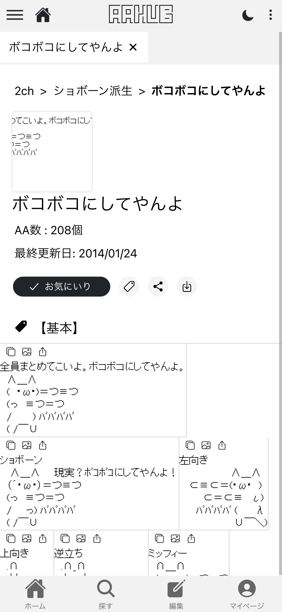

# Human User Interface Guidelineを読み直し、自分のサイトのIonButtonの見た目を見直す

こちらは [Ionic Advent Calendar 2024](https://qiita.com/advent-calendar/2024/ionic_jp) の 22 日目の記事となります。
21 日目までの記事は [rdlabo](https://qiita.com/rdlabo) さんが投稿されましたので、あわせてご覧ください。

Ionic は非常にキレイな UI コンポーネントライブラリで、趣味・業務問わずよく使っています。
業務であればデザイナーがいて整った UI を用意してくれますが、個人で作るとどうしても野暮ったい印象になりがちです。
そこで今回は、Ionic 公式ドキュメントをはじめとしたガイドラインを改めて読み直し、自作サイトの UI を改善した事例をご紹介します。

## 結論：Human User Interface Guideline

HUI（Human User Interface Guideline）を改めて読んでみると、ほとんどの事項が網羅されていました。
以前読んだ時は「なるほど、わかるわかる」と思っていたのですが、実際はあまり実践できていなかったことに気づかされました。自戒の念も込めて、HUI をもう一度しっかり読み込みたいと思います。

## 変更するサイト

今回テコ入れするのは、2016年から細々とメンテしているアスキーアートビューアーサイト「AAHub」です。
機能追加を継ぎ足してきた結果、`margin` や `padding` が雑になり、全体的にゴチャついた印象になっています。特に、IonButton の使い方が野暮ったいのが気になっていました。

<div class="image-container">
  <div class="box">
    
    
  </div>
  <p>もっとUI頑張れる</p>
</div>

## 野暮ったい理由

Human User Interface Guideline を読み返してみると、いくつかの点でガイドラインに反した使い方をしていました。例えば以下のような点です。


- 「開く」ボタンが視覚的に目立つのに複数ある
  - 目立たせるボタンは多くても 2 つまでが望ましい([参考](https://developer.apple.com/jp/design/human-interface-guidelines/buttons#Style))

<div class="image-container">
  <div class="box">
    
    
  </div>
  <p>App Storeは一覧と詳細ページで「入手」ボタンの色が変わっている</p>
</div>


- ミディアムサイズ以下のボタン形状をデフォルトのまま使っている（[参考](https://developer.apple.com/jp/design/human-interface-guidelines/buttons#iOS-iPadOS)）
  - 絶対ではありませんが、ミディアム以下のサイズは角が丸い形状（ラウンド）がApple純正アプリではよく見受けられた

<div class="image-container">
  <div class="box">
    
  </div>
  <p>(引用)ミディアム以下はラウンド形状のボタン。Apple純正アプリだと実際にこのスタイルが多い。</p>
</div>

- iOS ではサイドバーをなるべく使用しない（[参考](https://developer.apple.com/jp/design/human-interface-guidelines/sidebars#iOS)）
  - タブバー推奨とのこと。AAHubの場合、サイドバーがフォルダエクスプローラーとしての役割もあるため、消すのは難しい。
    - 解決策の一つはモダリティかな？Apple純正Itunes Storeアプリだとウィッシュリストの表示に使われている。
      - https://developer.apple.com/jp/design/human-interface-guidelines/modality

<div class="image-container">
  <div class="box">
    <video src="./images/itunes_store.MP4" width="300" controls muted>
  </div>
  <p>サイドバー以外で別画面でちょっとしたタスクを行うのに適した手法</p>
</div>

## Ionicによる実現

ボタンの形状やカラーリングは、IonButton のプロパティ指定だけで簡単に実装できます。
今までやらなかったのは、ただの怠慢でした。

```
<!-- 変更前 -->
<ion-button
  (click)="addBookmark()"
  color="dark"
  [fill]="isBookmarked ? 'solid' : 'outline'"
>
  <ion-icon
    slot="start"
    name="bookmark-outline"
  ></ion-icon>
  お気にいり
</ion-button>

<!-- 変更後 -->
<ion-button
  (click)="addBookmark($event)"
  color="light"
  shape="round"
  size="small"
>
  <ion-icon
    slot="start"
    [name]="isBookmarked ? 'checkmark-outline' : 'bookmark-outline'"
  />
  お気にいり
</ion-button>
```

<div class="image-container">
  <div class="box">
    
    
  </div>
  <p>少しマシな雰囲気になったがもっと頑張れそうではある</p>
</div>

##  まとめ

Human User Interface Guideline を「読んでいたつもり」で実践できていなかったので、改めて目を通す良いきっかけになりました。

本記事は 22 日から 3 日遅れでの投稿になりますが、実は当初「可変型の Virtual Scroll」を試してみようとしていました。ところが、現在の AAHub が採用しているタブによる画面切り替えと同時に Virtual Scroll を導入するのがうまくいかず、内容を方向転換した次第です。

結果として UI の見直しを行い、多くの学びが得られたので良しとします。とはいえ、`margin` や `padding` の調整、情報設計そのものの見直しなど、まだまだ修正の余地は多々あります。今後さらに手を加えたら、また知見を共有していければと思います。
それでは。